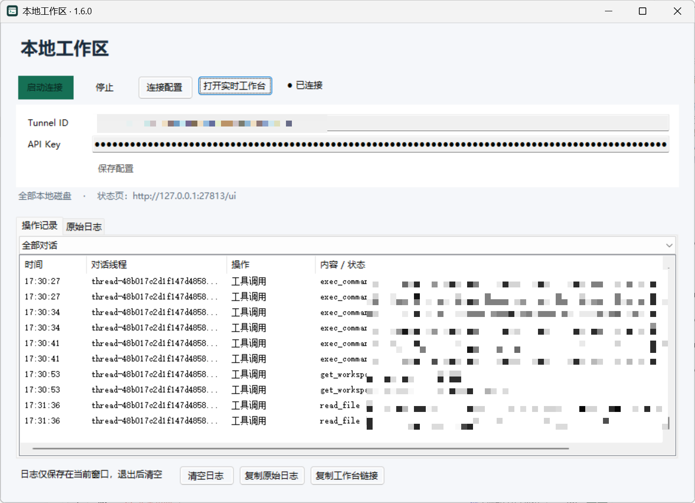
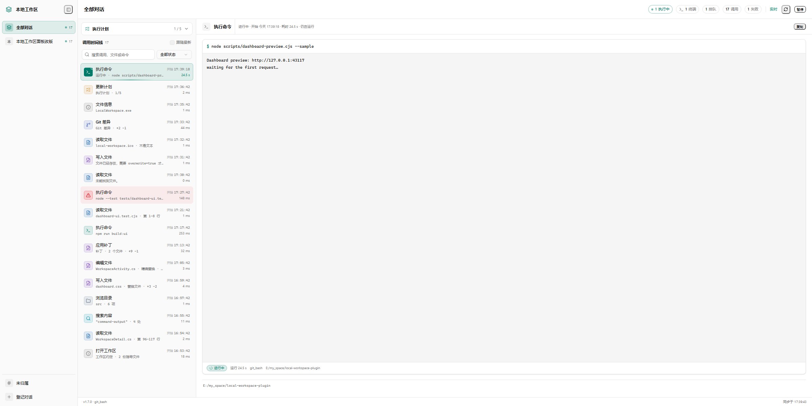
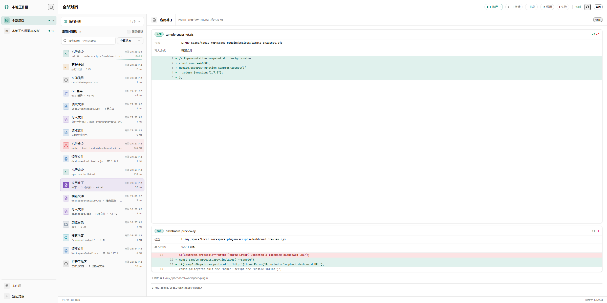

# ChatGPT Local Workspace Plugin

<p align="center">
  <a href="LICENSE"></a>
  
  
  
</p>

<p align="center">
  <a href="README.md">简体中文</a> · English
</p>

Let ChatGPT work directly on your machine through the **official OpenAI tunnel**: read and write files, make precise edits, run commands, review Git changes — and open a **live browser dashboard** that shows every tool call as a per-conversation timeline with command output and patch diffs. A single EXE, zero install, no Node.js required at runtime.

> Unofficial community project. Not affiliated with OpenAI.

| Desktop app: connection & operation log | Live dashboard: call timeline |
| --- | --- |
|  |  |



## Features

- **25 local tools**: file read/write, precise edits, multi-file patches, search, command execution with incremental output, Git review, execution plans.
- **Standalone live dashboard**: a locally compiled React + shadcn/ui single-page app, synced every second, timelines isolated per conversation, inspector rendered per call type (diffs, command output, file content, search hits).
- **Embedded ChatGPT task panel**: the `render_workspace` card refreshes read-only every 2 seconds without consuming model output.
- **Codex-style workflow**: `open_workspace` reads AGENTS.md conventions → `update_plan` shows real steps → `apply_patch` pre-validates then applies multi-file patches.
- **Single-file distribution**: native .NET Framework 4.8 EXE, listens on 127.0.0.1 only, no remote access.

## Requirements

| Item | Requirement |
| --- | --- |
| OS | Windows 10 / 11 x64 |
| Runtime | .NET Framework 4.8 (built into Win10 1903+) |
| ChatGPT plan | Supports creating custom connectors / tunnels |
| Command execution | Git for Windows by default (hidden Git Bash); system PowerShell also selectable explicitly |
| Node.js | Only for building the UI and running tests — not needed at runtime |

## Quick start

### 1. Download

Grab the release archive from [Releases](../../releases) and extract it anywhere. Keep `LocalWorkspace.exe` and the official `tunnel-client.exe` side by side.

### 2. Create a tunnel

In ChatGPT's developer settings, create a connector / plugin to obtain a **Tunnel ID** and **API Key** (see [OpenAI docs](https://platform.openai.com/docs/)).

### 3. Connect

Launch `LocalWorkspace.exe`, paste the Tunnel ID and API Key, click **Start**. Settings are stored in `%LOCALAPPDATA%/LocalWorkspacePlugin/settings.json` — **never commit or share this file**.

### 4. Refresh the plugin in ChatGPT

Open ChatGPT web → **Settings → Connectors → Local Workspace**, scroll to the bottom and click **Refresh** (this is the developer connection page; if the app detail page only shows "Reconnect", use the settings page instead). The action list should then contain all 25 tools.

### 5. Verify

In a new chat, say:

> Call get_workspace_status to confirm the connection

It should return `version: 1.6.0`, `tool_count: 25`, the actual executable path and this process's instance ID. The desktop log shows `initialize`, `tools/list` and tool receipts in order — "tunnel connected" alone does not prove ChatGPT refreshed the tools.

## Usage (how tools get called)

All tools are invoked automatically by the model — you just describe the task. Typical scenarios:

### File operations

> List the files in E:/projects/demo and change the port in config.json to 8080

→ the model calls `list_directory`, `read_file`, `edit_file`.

### Running commands

> Run npm test in E:/projects/demo and show me the failing output

→ `exec_command` starts it (hidden Git Bash by default); long tasks stream via `poll_command` / `read_command`; `stop_command` terminates when needed.

### Multi-file changes (Codex style)

> First call open_workspace on E:/work/api to load conventions, list a plan with update_plan, then add an export endpoint to the order module following AGENTS.md, and show me a git_diff when done

→ `open_workspace` → `update_plan` → `apply_patch` → `git_status` / `git_diff`. Tools never commit or push on their own.

### Open the live dashboard

After connecting, click **Open live dashboard** in the desktop app — a browser page synced from your machine every second, independent of ChatGPT cards. For each new conversation, start with:

> Call register_conversation for this chat, title "Refactor payment module", path E:/work/pay

The tool returns a local thread ID and a direct dashboard link; subsequent calls are grouped per conversation in the timeline.

### Embedded ChatGPT panel

> Open the live panel (render_workspace) for E:/work/api

The panel refreshes current operations, plans and command output read-only every 2 seconds. "Watching" means no tool is running right now — it does not mean the task is finished.

## The 25 tools

| Purpose | Tools |
| --- | --- |
| Conversation registration & dashboard deep links | `register_conversation` |
| Persistent task panel & standalone activity queries | `render_workspace`, `read_workspace_activity` |
| Workspace conventions, plans & multi-file patches | `open_workspace`, `update_plan`, `apply_patch` |
| Connection, version & activity diagnostics | `get_workspace_status` |
| Directories, file metadata & search | `list_directory`, `file_info`, `search_files`, `search_text` |
| Read text and images | `read_file`, `read_image` |
| Create directories, write & precise edits | `create_directory`, `write_file`, `edit_file` |
| Run commands, send stdin | `exec_command`, `write_stdin` |
| Command list, incremental output, snapshots, stop | `list_commands`, `poll_command`, `read_command`, `stop_command` |
| Change review | `show_changes`, `git_status`, `git_diff` |

`show_changes` covers only edits made through this process's file tools; `git_status` / `git_diff` also reveal changes from shells or other editors (Git diff excludes untracked file bodies).

## Dashboard details

- The left rail lists all conversations, unassigned entries and registered threads; selecting a thread filters timeline, plan and command output, so multiple chats on the same project never mix.
- Each timeline row shows start time, tool, target, status and elapsed time; running calls keep counting. Rows are color-coded per call type; selecting one renders a type-specific inspector: which files were written or replaced and the changed lines, file content (text expands up to 10 KB; binaries are flagged, not dumped), search hits, command output and exit code, or plan progress.
- "Follow latest" is on by default and auto-expands the newest call in the current filter; clicking a historical call pins it.
- Search, status filter, pause/resume (pausing only stops observation, never the task) and copy-registration-command are supported; on connection loss stale results stay visible and flagged.
- Calls without a thread ID land in "Unassigned" — no guessing. Thread grouping is visual isolation, not per-account authorization.
- Activity keeps the latest 100 entries and up to 200 threads for the current MCP process; re-register after a service restart.

Implementation: sources live in `src/ui/` (React components, Chinese labels in `lib/`), `src/dashboard.css` (Tailwind 4) and `src/dashboard.template.html`. `npm ci && npm run build:ui` compiles CSS with the Tailwind CLI, bundles components with esbuild, and inlines everything into a single `src/dashboard.html` — no CDN, no module loader, no Node at runtime. New builds prefer a `dashboard.html` next to the EXE and fall back to the embedded page.

Old running instances only have the embedded page: observe them read-only via `node scripts/dashboard-preview.cjs http://127.0.0.1:<port>/`, or preview the UI with built-in sample data using `--sample`. This entry never restarts the app or executes tools.

## Command execution details

- Commands run in a hidden Git Bash (`shell: "git_bash"`, legacy alias `bash` accepted). For PowerShell syntax pass `shell: "powershell"` or `"pwsh"` explicitly. A missing Git Bash fails loudly — the interpreter is never swapped silently, and Windows' WSL bash is never mistaken for Git Bash.
- Supports `cmd` / `cwd` / `yield_time_ms` (legacy `command` / `yield_ms` remain compatible); results report the actual shell and executable path.
- `write_stdin` without `chars` continues reading; sending Ctrl-C kills the command tree. Stdin is a pipe, not a PTY. Keep reading the same session for long tasks instead of relaunching.
- Default timeout 300 s (configurable 1–3600 s); output snapshots retain the last 128,000 characters with truncation flagged; a blocked stdin write terminates the command tree with an error so the MCP server never hangs.

## Process visibility

- Tool descriptions carry Chinese call-state text; when the host passes a progressToken, start/heartbeat/finish notifications are sent — unknown totals never show fake percentages.
- The desktop logs call starts immediately, records still-running calls every 2 seconds, and distinguishes results from failures.
- Whether cards render, collapse or show progress ultimately depends on the host; the plugin cannot force-display model thinking or bypass ChatGPT tool authorization.
- When the host provides `requestDisplayMode`, the embedded panel shows a "keep visible" (picture-in-picture) button.
- Legacy result cards keep text reading, pagination, search, diffs, sessions and image compatibility; stop buttons only kill the corresponding command tree.

## Build from source

```powershell
./build.ps1                                  # builds into dist-next
npm ci; npm run build:ui                     # rebuild the dashboard page
node tests/mcp.test.cjs                      # protocol & tools
node tests/patch.test.cjs                    # patch engine
node tests/activity.test.cjs                 # activity store
node tests/dashboard.test.cjs                # dashboard data
node --test tests/card.test.cjs              # chat cards
node --test tests/dashboard-ui.test.cjs      # real-browser UI regression
```

`tests/dashboard-ui.test.cjs` drives `src/dashboard.html` in a real browser: timeline, inspector content, plan cards and filters, no horizontal overflow at 1920/1366/640, distinct accent colors per call type in light and dark palettes. The browser is picked by `scripts/browser-launch.cjs` in the order `$env:WORKSPACE_TEST_BROWSER` → bundled Chromium → Chrome → Edge.

Real-tunnel smoke tests require `$env:WORKSPACE_TUNNEL_SMOKE='1'` before `node tests/tunnel.test.cjs`; it reuses existing settings — never run it against a second live instance of the same tunnel.

Key sources: `src/Program.cs` (desktop & tunnel), `src/WorkspaceServer.cs` (protocol & tools), `src/Presentation.cs` (resources & diffs), `src/PatchEditor.cs` (patching), `src/WorkspaceContext.cs` (conventions & plans), `src/WorkspaceActivity.cs` (activity store), `src/ui/` (dashboard). Official DevSpace sources are vendored under `vendor/devspace/` (MIT); the shipped EXE does not depend on its Node service — see [docs/DEVSPACE-SOURCE.md](docs/DEVSPACE-SOURCE.md).

Verification records: [VERIFICATION.md](VERIFICATION.md). Upgrade notes: [UPGRADE-NOTES.md](UPGRADE-NOTES.md).

## Updating

`Apply-Update.ps1` refuses to overwrite while the app or tunnel is running and never kills processes automatically. Close the app first (this ends its command tree), run the update script, then relaunch from the same dist. After tool metadata changes, refresh in ChatGPT settings and **start a new chat** to verify.

## Troubleshooting

**ChatGPT claims it can only read?** Have it call `get_workspace_status` and check version, `tool_count: 25` and connection; then refresh metadata in settings and open a new chat. Don't blame OS permissions for stale chat caches, old plugin versions or a service that isn't running.

**"Tunnel connected" but tools don't respond?** Tunnel connectivity ≠ ChatGPT refreshed the tools. The desktop log must show `initialize` and `tools/list`.

**Panel stuck on "Watching"?** No tool or model call is running right now; model thinking is outside the plugin's visibility and this is not a failure signal.

**"Git Bash not found" from commands?** Install [Git for Windows](https://git-scm.com/download/win), or have the model pass `shell: "powershell"` explicitly.

## Security notes

- The dashboard listens only on a dynamic `127.0.0.1` port; no remote access or execution endpoints are exposed.
- Local disks are accessed with the current Windows user's privileges; the workspace is **not** an OS sandbox — run under a trusted account.
- `settings.json` contains your API key — never commit, screenshot or share it.
- Service and activity records live in the current process; reconnect and re-register after restarts.

## Official references

- [OpenAI MCP Apps UI & bridging](https://developers.openai.com/plugins/build/chatgpt-ui)
- [Tool metadata, output structure & annotations](https://developers.openai.com/plugins/reference#tool-descriptor-parameters)
- [MCP progress notifications](https://modelcontextprotocol.io/specification/2025-06-18/basic/utilities/progress)
- [DevSpace official source](https://github.com/Waishnav/devspace)

## License & attribution

This is an unofficial open-source project, not affiliated with OpenAI. Released under the MIT license (see [LICENSE](LICENSE)).

- Architecture and tool design reference and partially derive from [Waishnav/devspace](https://github.com/Waishnav/devspace) (MIT); its sources are vendored under `vendor/devspace/` with the original license file.
- `tunnel-client.exe` in release archives is the official OpenAI component (Apache-2.0), distributed via GitHub Releases and not versioned in this repository.

## Star History

If this project helps you, a Star is appreciated.
