# ChatGPT Local Workspace Plugin

<p align="center">
  <a href="LICENSE"></a>
  
  
  
</p>

<p align="center">
  <a href="README.md">简体中文</a> · English
</p>

Let ChatGPT work directly on your machine through the **official OpenAI tunnel**: read and write files, make precise edits, run commands and review Git changes. The desktop app embeds a **live workbench** (WebView2, also available in a browser) that shows every tool call per conversation as a timeline with command output and patch diffs. A single EXE, no installer, no Node.js at runtime.

> Unofficial community project. Not affiliated with OpenAI.

**What it's for**: drive your machine's files, commands and Git straight from a **ChatGPT web conversation**, and replay every tool call in the live workbench. The `codex` CLI and `@modelcontextprotocol/server-filesystem` live in a terminal or TUI; this plugin runs **inside ChatGPT web** and ships a visual timeline, diffs and command output, with no separate terminal and no always-on Node service. The same EXE also works as a stdio MCP server for Codex (see [Recommended Codex configuration](#recommended-codex-configuration)).

| Desktop app: embedded live workbench (connection settings in the fourth tab) | Live workbench: turn-grouped call timeline |
| --- | --- |
| 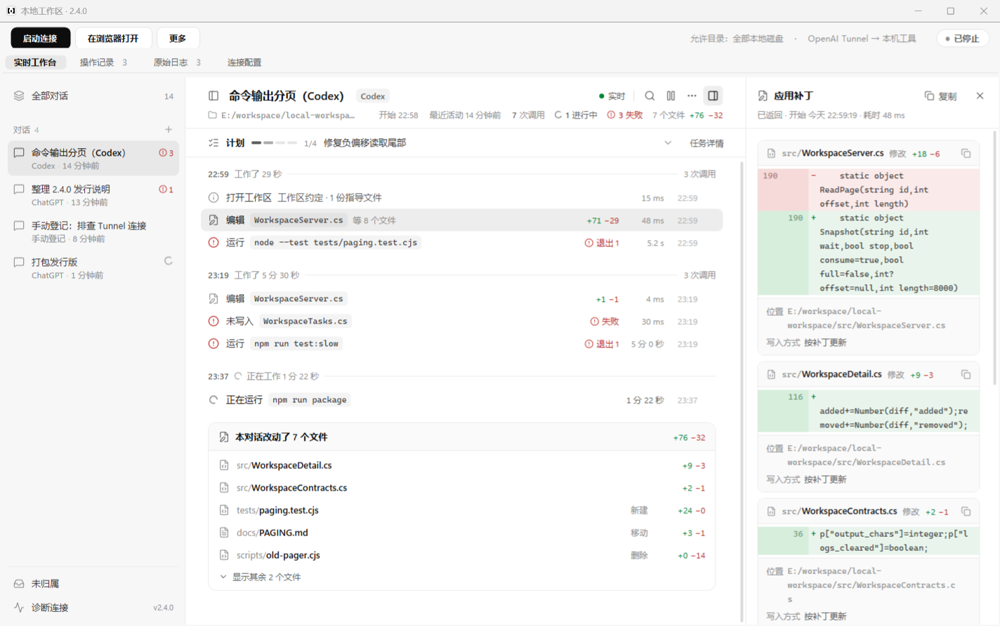 | 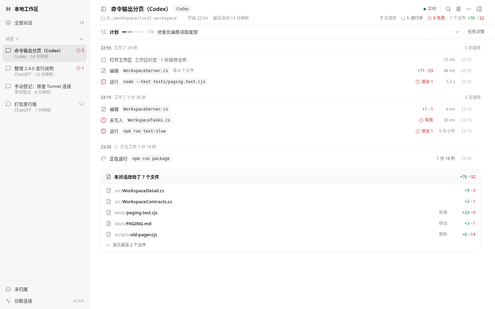 |

Current version **2.4.0** (2026-10-08; previous public release 2.3.0). See the [upgrade notes](UPGRADE-NOTES.md) for every release, the [2.4.0 release notes](docs/RELEASE-2.4.0.md) for migration details and upstream limits, and the [verification record](VERIFICATION.md) for test results. The upgrade and verification notes are written in Chinese.

## Contents

- [What changed in 2.4.0](#what-changed-in-240)
- [Features](#features) · [Requirements](#requirements) · [Quick start](#quick-start) · [Usage](#usage)
- [The 23 tools](#the-23-tools) (including the [2.4.0 tool mapping](#240-tool-mapping) and [Recommended Codex configuration](#recommended-codex-configuration))
- [Live workbench](#live-workbench) · [Desktop app](#desktop-app)
- [Command execution details](#command-execution-details) · [Process visibility](#process-visibility) · [Release history](#release-history)
- [Build from source](#build-from-source) · [Updating](#updating) · [Troubleshooting](#troubleshooting) · [Security notes](#security-notes) · [Protocol compatibility](#protocol-compatibility)

## What changed in 2.4.0

- **28 → 23 tools.** `poll_command`, `stop_command`, `list_commands`, `read_workspace_activity` and `file_info` are folded into existing tools and no longer appear in `tools/list`. They remain callable in this release, return a `deprecated` marker with the replacement, and are scheduled for removal in **2.5.0**. See the [2.4.0 tool mapping](#240-tool-mapping). **If your Codex `config.toml` names any old tool (`enabled_tools`, `disabled_tools`, `tools.<name>`, …), rename it.**
- **Read-only polling.** `read_command` gains `yield_time_ms`; with `offset=next_offset` it returns as soon as new output or exit arrives, and keeps `readOnlyHint=true`, so Codex with `default_tools_approval_mode = "writes"` no longer prompts for every poll. Stop a command by sending Ctrl-C (U+0003) through `write_stdin`.
- **Workbench redesign.** Three panes (conversations | timeline | inspector) that collapse at 1280 / 1100 / 720 px, with the inspector becoming a drawer on narrow windows; a header with source, connection state and call / failure / change counts; a collapsible plan bar; one-line rows with gray type icons, grouped by Codex turn or 30-second gaps; inline expansion with truncated long content; a changes summary; Ctrl+F search with segmented filters; j/k navigation; connection diagnostics and the version pinned to one row in the sidebar footer. See [Live workbench](#live-workbench).
- **Conversation source and stats.** `conversations[].source` reports `codex` / `chatgpt` / `manual`; `conversations[].stats` reports calls, running, failed and added/removed lines; write receipts carry per-file `added` / `removed` (multi-file patches count every written file); activity rows add `turn_id` / `turn_source` / `trace_id`. Codex calls are grouped by `_meta.threadId`, with turn IDs read from `x-codex-turn-metadata`.
- **Desktop look.** The desktop window, the WebView2 default background, the workbench shell and the sidebar share neutral `#f7f7f7`; the main pane is white `#fff`. The first frame at startup matches the page, so there is no white flash; the embedded page always uses the light scheme. Ctrl+wheel and Ctrl+plus/minus/0 zoom the workbench (67%–200%), and the level is saved in `settings.json` for the next launch. Toolbar and tabs are flat.
- **New app icon.** Black brackets and a block cursor on a white rounded tile. The EXE embeds 9 frames (16/20/24/32/40/48/64/128/256; 16–32 are pixel-tuned by hand), and the title bar, taskbar, page favicon and the sidebar brand mark in the browser all use the same mark.
- **Old records are actually deleted** (fixing 2.3.0 writing call bodies to disk and showing old logs after a restart). Old calls, conversation titles, paths, plans and validation logs are no longer restored; startup deletes legacy `activity.bin`, `activity-state.bin`, `plans.bin` and `threads.bin`. Re-register plans and evidence to continue an old task. Encrypted minimal identity bindings still protect command retries and file undo.
- **Manual clearing.** The workbench **⋯ → Clear completed logs…** (with confirmation) and the desktop **More → Clear completed logs** run the same cleanup and reset desktop tab counters immediately. Running commands, current plans, task evidence and registered conversations are kept.
- **Component updates.** Official Tunnel Client **0.0.16**, WebView2 SDK **1.0.4258.31**; Radix UI, Lucide, Playwright, shadcn, cn and compatible development dependencies are updated. MCP **2026-07-28** and legacy handshakes remain supported.
- **Less output and fewer writes.** Command receipts return the body once in `output`; request `include_full_output: true` for the bounded compatibility field `full_output`. Page reads copy only the requested range. Bindings only write when identity changes, and full capacity reclaims old bindings with no current use, retry or undo reference.
- **Version checks.** Connection diagnostics list the running and on-disk version of each component with a status: up to date / new version used after restart / running version unknown / program file not found. The build checks that vendored WebView2 assemblies match `runtime-components.json`.
- **Rollback folders.** `Apply-Update.ps1` keeps the newest 3 rollback folders by default (`-KeepRollbacks`); folders in use are skipped with a warning.

Download the [v2.4.0 Windows x64 release](https://github.com/CSL19980820/chatgpt-local-workspace/releases/tag/v2.4.0); component checksums are in [runtime-components.json](runtime-components.json). Upgrading from 2.3.x is covered by the [upgrade checklist](UPGRADE-NOTES.md#从-23x-升级清单) (Chinese).

## Features

- **23 local tools**: file read/write, precise edits, multi-file patches, search, command execution with incremental output, file history and undo, Git review, execution plans and completion checks.
- **Dual-era MCP protocol**: one EXE serves legacy 2025-06-18 clients (`initialize` handshake, what the ChatGPT Tunnel uses today) and modern [2026-07-28](https://modelcontextprotocol.io/specification/2026-07-28) stateless clients: `server/discover`, per-request `_meta` version negotiation, `resultType`, cacheable `tools/list`, MRTR confirmations for destructive operations, the official Tasks extension, OpenTelemetry trace correlation and tool icons.
- **Embedded live workbench**: the desktop app's first tab embeds the workbench page (WebView2, shipped with Edge; falls back to the browser when the runtime is missing), synced every second. Three panes, isolated per conversation and grouped by turn; details render per call type (images, workspace status, diffs, command output, file text, search hits) inline or in the inspector.
- **One-piece desktop shell**: single-row toolbar (combined start/stop, open in browser, More menu) plus four tabs (live workbench / operation log / raw log / connection settings); the log views are owner-drawn with level colors, monospace type and tail-follow.
- **Codex-style workflow**: `open_workspace` reads AGENTS.md conventions → `update_plan` shows real steps → `apply_patch` pre-validates then applies multi-file patches → `check_task_completion` before delivery.
- **Single-file distribution**: native .NET Framework 4.8 EXE (WebView2 components embedded as resources), listens on 127.0.0.1 only, no remote access.

## Requirements

| Item | Requirement |
| --- | --- |
| OS | Windows 10 / 11 x64 |
| Runtime | .NET Framework 4.8 (built into Win10 1903+) |
| Embedded workbench | WebView2 Runtime (present on Win10/11 with Edge); without it the workbench opens in the browser and all tools keep working |
| ChatGPT plan | A paid plan that supports **Developer Mode** (Plus / Pro / Team / Enterprise, etc.; check current eligibility), used to create the connector and tunnel |
| Command execution | Git for Windows by default (hidden Git Bash); system PowerShell can be selected explicitly |
| Node.js | Only for building the UI and running tests, not at runtime |

> **On platform scope**: Windows-only is a deliberate tradeoff: a single install-free native EXE that listens on loopback with no Node/Python runtime dependency. .NET Framework 4.8 ships with Win10 1903+, so the release needs no runtime install. There is no macOS / Linux build.

## Quick start

### 1. Download

Grab the release archive from [Releases](../../releases) and extract it anywhere. Keep `LocalWorkspace.exe` and the official `tunnel-client.exe` in the same folder.

### 2. Enable Developer Mode and create a connector

This happens in **ChatGPT web**, not in this plugin:

1. **Enable Developer Mode**: sign in to ChatGPT web → Settings → find **Developer Mode** and turn it on. If you don't see the toggle, your plan most likely doesn't include Developer Mode; this is the most common blocker.
2. **Create a connector**: go to ChatGPT's plugins / connectors page (`chatgpt.com/plugins`), click create (+), and add a connector pointing at your local MCP server.
3. **Get the Tunnel ID and API Key**: the official `tunnel-client.exe` bundled in the release bridges your local server to ChatGPT; the connector flow yields the **Tunnel ID** and **API Key** you paste into the desktop app next.

> For the authoritative steps and current UI labels, follow the [OpenAI Apps SDK Quickstart](https://developers.openai.com/apps-sdk/quickstart/). `platform.openai.com/docs` is the **API reference**, not this connector / Developer Mode flow.

### 3. Connect

Launch `LocalWorkspace.exe`, enter the Tunnel ID and API Key in the **connection settings** tab (if either is missing or malformed, **Start** jumps to that tab and highlights the field), then click **Start** in the toolbar (it turns into **Stop** once connected). The Tunnel ID and the workbench zoom level are stored in `%LOCALAPPDATA%/LocalWorkspacePlugin/settings.json`; the API key is stored in Windows Credential Manager, and old plaintext keys migrate on startup.

After connecting, the app switches to the **live workbench** tab.

### 4. Refresh the plugin in ChatGPT

Open ChatGPT web → **Settings → Connectors → Local Workspace**, scroll to the bottom and click **Refresh** (this is the developer connection page; if the app detail page only shows "Reconnect", use the settings page instead). The action list should then contain **23 tools**; 2.4.0 no longer lists the old names.

### 5. Verify

In a new chat, say:

> Call get_workspace_status to confirm the connection

It should return `version: 2.4.0`, `tool_count: 23`, `protocol_versions`, the actual executable path and this process's instance ID. The **raw log** tab shows `initialize`, `tools/list` and tool receipts in order; "connected" alone does not prove ChatGPT refreshed the tools. Tunnel 0.0.16 requires `initialize` and `notifications/initialized` before legacy tool calls; modern requests carry their full negotiation metadata.

## Usage

All tools are invoked automatically by the model; you just describe the task.

### File operations

> List the files in E:/projects/demo and change the port in config.json to 8080

→ the model calls `list_directory`, `read_file`, `edit_file`.

### Running commands

> Run npm test in E:/projects/demo and show me the failing output

→ `exec_command` starts it (hidden Git Bash by default); long tasks wait and read output with `read_command` (`yield_time_ms` + `offset=next_offset`), send input with `write_stdin`, and stop with Ctrl-C.

### Multi-file changes (Codex style)

> First call open_workspace on E:/work/api to load conventions, list a plan with update_plan, then add an export endpoint to the order module following AGENTS.md, and show me a git_diff when done

→ `open_workspace` → `update_plan` → `apply_patch` → `git_status` / `git_diff`. Tools never commit or push on their own.

### Grouping by conversation

Calls are grouped automatically when the host provides `openai/session` (ChatGPT) or `_meta.threadId` (Codex), with the workspace directory name as the default title. Otherwise the model calls `register_conversation` first and passes the returned `thread_id` afterwards. State the directory:

> This chat is refactoring the payment module under E:/work/pay

The tool returns a local thread ID and a direct workbench link. Add a title to customize the name, or have the model pass a known `chat_id` to bind the real ChatGPT conversation (the same `chat_id` reuses one thread).

> **Association boundaries:** `openai/session` is an anonymous correlation hint, not a ChatGPT `/c/` ID or authentication. The server hashes organization, subject and session together and stores the association encrypted. Calls with neither host metadata nor `thread_id` land in "Unassigned".

### Save a chat attachment locally

> Save this chat attachment as E:/projects/demo/inbox/requirements.pdf

When the host provides file input, the model uses `import_file`. The destination directory must exist and the destination file must be new. HTTPS download failures do not leave a partial file, and signed URLs are kept out of local logs and workbench receipts. Host attachment support is required.

## The 23 tools

> Full input parameters, types and return fields are in [docs/TOOLS.md](docs/TOOLS.md) (Chinese). The table groups them by purpose.

| Purpose | Tools |
| --- | --- |
| Conversation registration & workbench deep links | `register_conversation` |
| Workspace conventions, plans & multi-file patches | `open_workspace`, `update_plan`, `apply_patch` |
| Task completion check before delivery | `check_task_completion` |
| Connection, version, command sessions & activity diagnostics (live workspace snapshot with `path`) | `get_workspace_status` |
| Directories, file metadata & search | `list_directory` (metadata when `path` is a file), `search_files`, `search_text` |
| Read text and images | `read_file`, `read_image` |
| Save chat attachments as new local files | `import_file` |
| Create directories, write & precise edits | `create_directory`, `write_file`, `edit_file` |
| Run commands, send stdin, stop (Ctrl-C) | `exec_command`, `write_stdin` |
| Read-only command output and waiting | `read_command` |
| File history and undo / redo | `workspace_history`, `restore_change` |
| Change review | `show_changes`, `git_status`, `git_diff` |

By default `show_changes` covers edits recorded by this process's file tools; its `workspace_open` / `last_shown` baselines also include external changes and non-ignored new files, using private review refs without touching the normal index or branch. `git_status` / `git_diff` provide the usual Git view (Git diff excludes untracked file bodies).

### 2.4.0 tool mapping

| Old tool (hidden in 2.4.0, removed in 2.5.0) | Use | How |
| --- | --- | --- |
| `poll_command` | `read_command` | `{session_id, yield_time_ms: 5000, offset: <previous next_offset>}`; returns on new output or exit, never consumes output |
| `stop_command` | `write_stdin` | `{session_id, chars: "\u0003"}` (Ctrl-C stops the command tree) |
| `list_commands` | `get_workspace_status` | read `result.commands` (with `thread_id`, running state and exit code) |
| `read_workspace_activity` | `get_workspace_status` | pass `path`, read `result.workspace`; still non-blocking and kept out of the activity timeline |
| `file_info` | `list_directory` | same `path`; files return `kind: "file"` plus `info`, directories also include `info` |

Old names stay callable for one release: `structuredContent.result.deprecated` carries `tool`, `replacement`, `removed_in: "2.5.0"` and a note, the summary starts with `DEPRECATED:`, and `get_workspace_status` lists them in `deprecated_tools`. Cached host metadata keeps working for now, but refresh the tool list.

### Recommended Codex configuration

Codex (CLI / IDE / desktop) can start `LocalWorkspace.exe --mcp` directly as a stdio server, without the desktop app or the tunnel. Suggested `~/.codex/config.toml`:

```toml
[mcp_servers.local_workspace]
command = "E:/path/to/LocalWorkspace.exe"   # use the actual path
args = ["--mcp"]
default_tools_approval_mode = "writes"     # read-only tools (including read_command polling) skip approval; writes and commands still ask
tool_timeout_sec = 60                      # exec_command / read_command wait at most 10 s per call

[mcp_servers.local_workspace.tools.read_command]
output_token_limit = 12000

[mcp_servers.local_workspace.tools.read_file]
output_token_limit = 12000
```

> **Codex users upgrading from 2.3.x:** if `enabled_tools`, `disabled_tools` or `[mcp_servers.<name>.tools.<tool>]` mention `poll_command`, `stop_command`, `list_commands`, `read_workspace_activity` or `file_info`, rename them per the table above; from 2.5.0 those entries no longer match any tool. This configuration follows the Codex documentation and has not yet been exercised item by item in a live Codex session.

## Live workbench

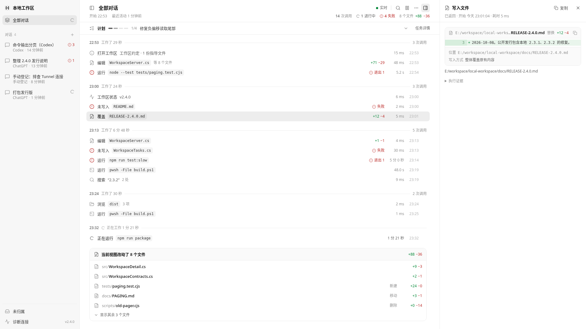

*A 1920-px-wide window: the conversation sidebar on the left, the call timeline grouped by turn in the middle, and the inspector on the right showing the selected patch line by line.*

The desktop app embeds this page in its first tab (WebView2); **Open in browser** in the toolbar opens the same single-page app with identical features. The workbench only observes: it never runs tools or changes files. It syncs with the local service once per second.

### Layout and window width

Three panes: **conversations | timeline | inspector**. Narrow windows collapse step by step without horizontal scrollbars.

| Window width | Behavior |
| --- | --- |
| ≥ 1280 px | Three panes side by side, inspector open by default |
| 1100–1279 px | Inspector stays docked on the right but starts closed; open it with the header's inspector button |
| < 1100 px | Inspector becomes a right-hand drawer over the timeline; Esc or the button closes it; it never opens on its own |
| ≤ 960 px | Sidebar narrows to 220 px, page margins shrink |
| ≤ 720 px | Sidebar collapses to a 52 px icon rail with names on hover |

- Widths are page widths in CSS px. When the desktop app zooms, page width = window width ÷ zoom; a 1400 px window at 125% lays out as 1120 px.
- Drag the inspector's left edge to resize it; with keyboard focus on the edge, ←/→ step 16 px. The width ranges from 320 to 640 px and always leaves the timeline at least 480 px. Default width: 360 px below 1440 px, 400 px below 1800 px, otherwise 480 px.
- The sidebar button at the far left of the header (before the title) collapses or expands the sidebar and stays in place either way; it is hidden in the icon-rail mode (≤720 px).
- The sidebar collapse state, the inspector's open state and width, and the plan bar's expansion are remembered in local browser storage.
- The timeline content is at most 1120 px wide, which only matters on very wide windows. The inspector is hidden while there are no calls.

### Sidebar

- Its first row lines up with the header title: the "Local Workspace" brand row in a browser; when embedded in the desktop app the brand row is hidden (the window title already names the app) and the first row is **All conversations**.
- Then **All conversations** and the "Conversations N" group, whose **+** generates a registration prompt. While a call is running, All conversations shows a spinner; otherwise it shows the total call count.
- Each conversation takes two lines: the title, then "source · N minutes ago". On the right, a spinner while a call runs, otherwise a red failure count. The current conversation is highlighted.
- With no registered conversations it says that calls will be grouped once you register one with **+**.
- The footer always shows **Unassigned** and **Connection diagnostics**; the current version (e.g. `v2.4.0`) appears in small gray text at the right of the diagnostics row. A collapsed sidebar or icon rail shows icons only.

### Header and conversation stats

- **First line**:
  - The sidebar button, then the conversation title.
  - Source chip from the server's `conversations[].source` (Codex / ChatGPT / manual), decided by the host binding; older servers without the field fall back to inferring from call data. A link back to the original chat appears when one is known.
  - Connection state: live / paused / disconnected / connecting; hover for "synced at hh:mm:ss".
  - Icon buttons on the right: **search & filter**, **pause / resume sync**, the **⋯ menu** and the **inspector toggle**.
- **Second line**: the workspace path (opens in Explorer), "started hh:mm", "last activity X ago", call counts (calls, running, queued, failed) and change totals ("N files +added −removed"). Secondary items hide one by one as the window narrows.

### Plan bar

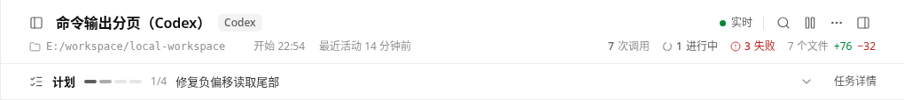

*The plan bar sits under the header and never covers the timeline; **Task details** opens on demand.*

- Collapsed to one line by default: plan icon, segmented progress, "done/total", the current step and an expand arrow. Expanded, it lists every step: a check for done, a dot or spinner for in progress, an empty circle for pending. With many steps it takes at most 40% of the window and scrolls inside.
- In the All conversations view, plans are grouped by conversation with their explanations.
- The plan bar is outside the timeline's scroll area and never covers a call row.
- **Task details** opens a dialog with blocking reasons, verification records and a copyable continuation prompt. Once closed, polling and state changes never reopen it. You can also send "continue" in the original conversation.

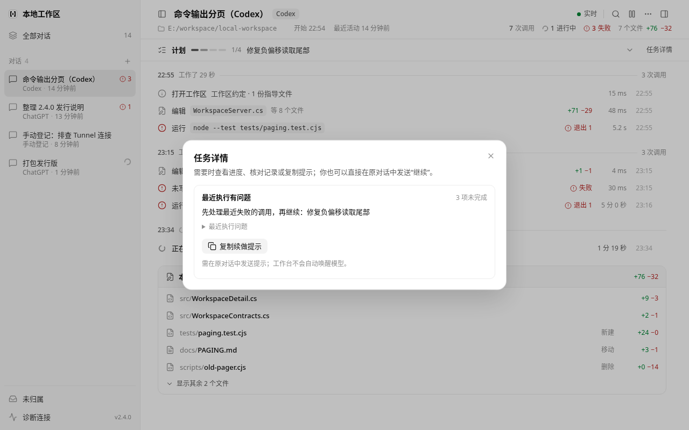

*After clicking Task details: task state, execution records and a copyable prompt; nothing is sent automatically.*

### Timeline

- **One row per call** with a gray type icon: command (terminal), write (separate icons for create / delete / move / modify), read (file), search (magnifier), directory (folder), image, plan (checklist), diff (compare), workspace status (activity). Running calls show a spinner and failed calls a red alert icon; there are no per-type colors.
- **Row text** combines the verb, a monospaced command or file name, and a short note such as "and N files", "lines a–b", "N hits", "N entries" or "not text". At the end: added/removed lines, the failure reason (e.g. "exit 1"), elapsed time (counting while running) and the start time (when the content area is ≥ 720 px). Hover a row for the full start time.
- **Grouped by turn**: adjacent calls that all carry a `turn_id` (currently from Codex) are grouped exactly by it; otherwise a gap of more than 30 seconds starts a new group. Group headers read "hh:mm worked X ── N calls", or "working X" while in progress; single-call groups omit the count.
- At the bottom, new calls scroll into view automatically; scrolling up stops following and shows **Jump to latest**.
- **Clicking a row** expands its details inline when the inspector is closed (several rows can be open), or selects it and shows the details in the inspector when it is open.

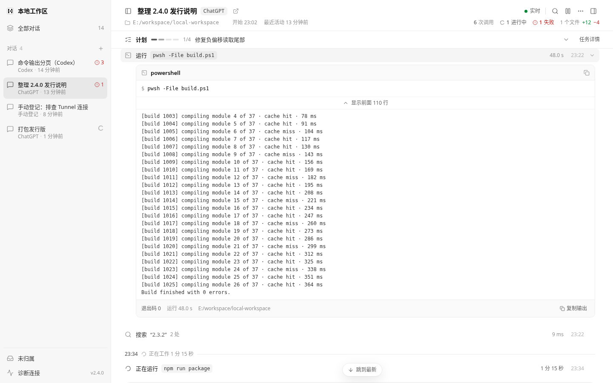

*With the inspector closed, clicking a call expands its code block right in the timeline; long output shows the end first and earlier lines on demand.*

### Call details and code blocks

Inline expansion and the inspector share the same detail views.

- **Code blocks**: a header with type icon, dimmed directory, bold file name, tags, added/removed counts and a copy button; line-numbered body with background-only diff colors; a footer with location, write method, write size, exit code, duration, working directory and copy output.
- **Long content is truncated first**; expanded blocks take at most 60% of the window and scroll inside:

  | Type | Shown first | Expand button |
  | --- | --- | --- |
  | diff | 40 lines | show the remaining N lines |
  | file text | 24 lines | show the remaining N lines |
  | command output | last 24 lines | show the earlier N lines |
  | search hits | 12 hits | show the remaining N hits |
  | directory entries | 30 entries | show the remaining N entries |
  | text | 40 lines | show the remaining N lines |

- **Per call type**: writes and patches list changed lines per file, rejected writes list only the path; reads expand text up to 10 KB with a notice beyond that, binaries are marked "not text"; searches show hit locations; commands show output and exit code; `read_image` shows the image as read, switchable between fit and original size; `get_workspace_status` shows version, paths, shell, running commands and the tool list.
- **Inspector extras**: a meta line "state · start · duration · trace short ID" (trace when the request carried `traceparent`); collapsible **execution evidence** with activity ID, file SHA256 and `change_id`.
- Directories, files, search results and working directories in the details are clickable and open or select the item in Explorer. Clicking an executable or script never runs it.

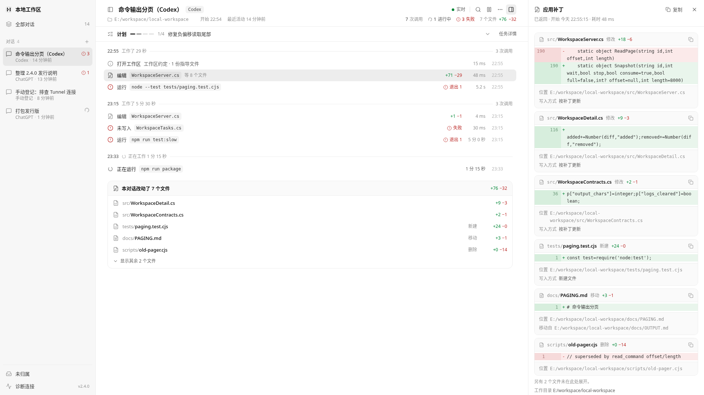

*A multi-file patch in the inspector: one code block per file, background-only add/remove colors, location and write method in the footer.*

| Image detail: the bytes as read | Workspace status: connection, paths and tools |
| --- | --- |
| 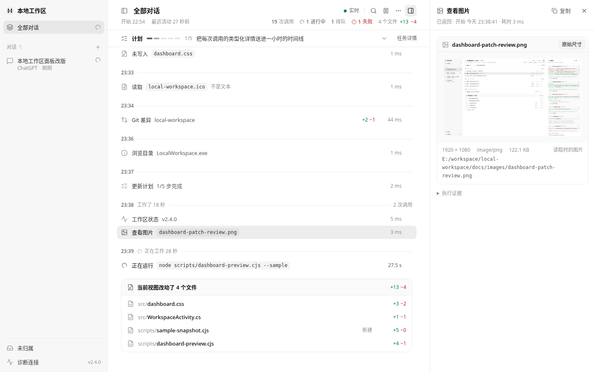 | 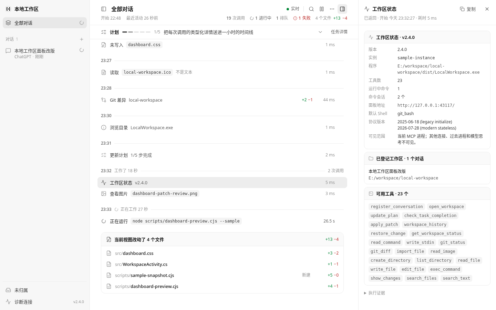 |

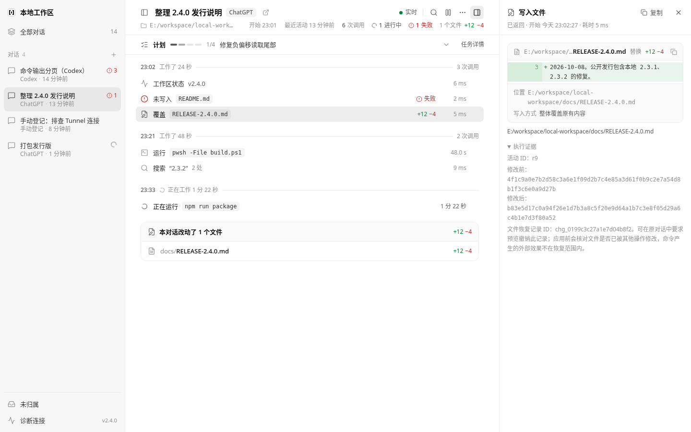

*Execution evidence in the inspector: activity ID, file SHA256 and the undoable `change_id`.*

Image previews live only in the current process's memory, up to 100 images / 32 MiB; after eviction or a restart, read the image again. A path's current content is never passed off as the original preview.

### Changes summary

The end of the timeline has a summary card titled "this conversation changed N files" ("this view changed N files" in the All view) with total added/removed lines.

- Long lists fold automatically: with more than 6 files the card lists the first 5 and folds the rest under "show the other N files"; "collapse" folds them back.
- One row per file: file type icon, dimmed relative directory, bold file name, create / delete / move tags, and added/removed counts.
- Clicking a file jumps to its call and highlights it briefly.
- Beyond the summary limit, a note says how many more files are not listed.

### Search and filter

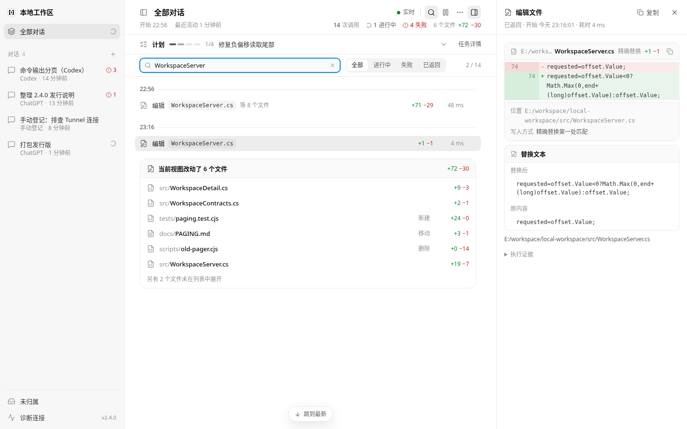

*Ctrl+F opens search; the segmented filter and keywords apply together, and the right side shows "matches / total".*

- Open with **Ctrl+F**, **/** outside an input, or the header's search button. Esc closes an empty search box.
- Searches calls, files and commands. The segmented filter has four options: **All / Running / Failed / Returned**.
- The counter shows "N calls", or "matches / total" while filtering.
- With no matches it says so and offers **Clear filters**.

### Keyboard

| Keys | Action |
| --- | --- |
| Ctrl+F / `/` | Open search |
| Esc | Close an empty search box; close the inspector drawer on narrow windows |
| ↓ / `j`, ↑ / `k` | With focus on a timeline row, move to the next or previous row; selects it when the inspector is open |
| ← / → | With focus on the inspector edge, resize the inspector |
| Ctrl+wheel, Ctrl+plus / minus / 0 | Zoom the workbench (desktop app only, see [Zoom](#zoom)) |

### ⋯ menu and clearing logs

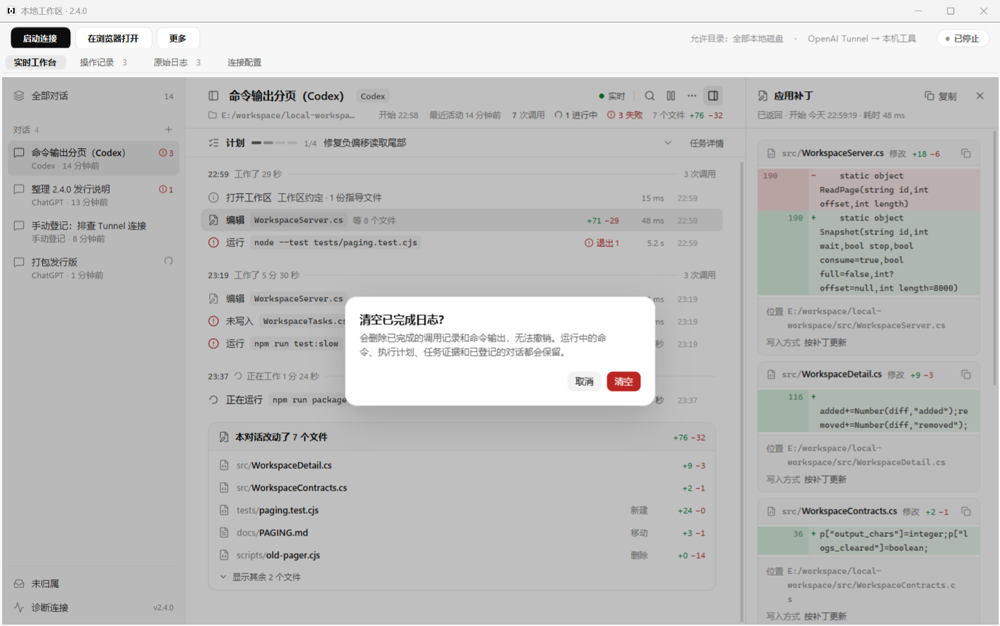

*Clearing completed logs; running commands, plans, task evidence and registered conversations are kept.*

The header's **⋯** menu offers **Sync now**, **Connection diagnostics** and **Clear completed logs…**.

1. **Clear completed logs…** first asks for confirmation: completed call records and command output are deleted and cannot be restored; running commands, plans, task evidence and registered conversations are kept.
2. After **Clear**, a short notice at the bottom reports how many entries were removed, or why clearing failed.

The desktop **More → Clear completed logs** runs the same cleanup and resets the desktop tab counters. After clearing, retrying the original command still reuses its session, and failure records still count in completion checks, so hidden logs never make a task look finished.

### Connection diagnostics

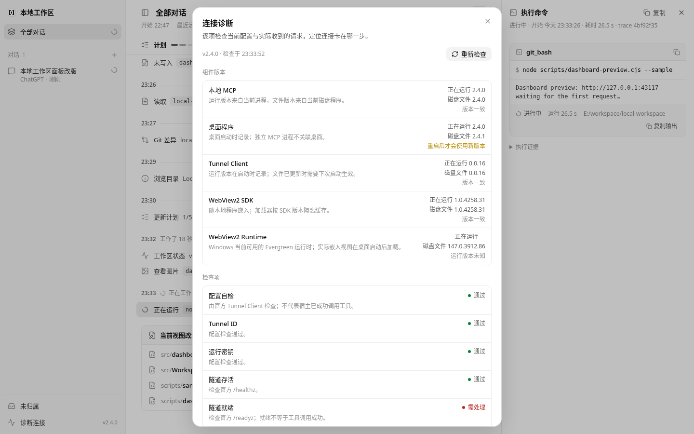

*Diagnostics compare the running and on-disk versions, then check configuration, tunnel, handshake, tool discovery, actual calls and session metadata.*

- Entry points: **Connection diagnostics** in the sidebar footer (always there), header **⋯ → Connection diagnostics**, the **Diagnostics** button on the connection-error page, and desktop **More → Diagnose connection**; you can also append `#diagnostics` to the page address.
- Each component row shows the running version, the on-disk version and a status: up to date / new version used after restart / running version unknown / program file not found on disk. Missing versions show "—".
- Checks that have not happened are marked as pending. Diagnostics never restart the connection. On short windows the whole dialog scrolls.

### Empty, loading and error states

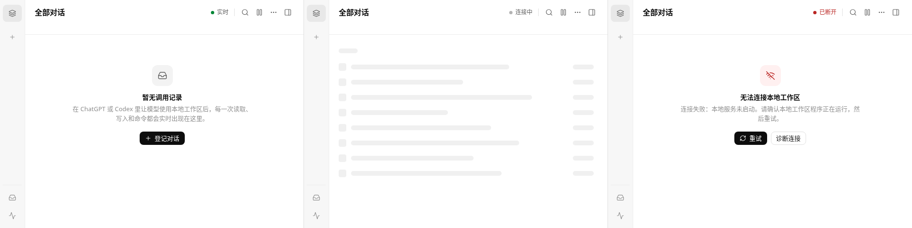

*From left to right: no calls yet, the first-load skeleton, and cannot connect to the local workspace.*

- **Loading**: a static skeleton, no shimmer animation.
- **No calls yet**: explains where calls will appear and offers **Register conversation**.
- **Cannot connect to the local workspace**: shows the reason with **Retry** and **Diagnostics**.
- **Disconnected with data on screen**: keeps the existing content and shows a banner with **Retry**.
- **Service instance changed**: after a restart the page asks you to reopen the workbench instead of mixing records from the old and new processes.

### Look

Fixed light scheme that ignores the system dark mode. The shell and sidebar are `#f7f7f7` and the main pane is white `#fff`; the desktop window and the WebView2 default background are also `#f7f7f7`, so the first frame at startup matches the page shell. Neutral grays throughout, with no per-type colors, gradients or blinking animations; only failures use red. Fonts: Segoe UI Variable Text first, then Segoe UI, with Microsoft YaHei UI for Chinese text.

### Sync and pause

- The page syncs once per second. **Pause** only stops page sync; it never pauses or stops running work, and elapsed times keep counting locally. **Resume** or ⋯ → **Sync now** refreshes immediately.
- Polling stops while the page is in the background and resumes when it returns.

### Association and retention

- Calls with neither host session metadata nor a thread ID land in "Unassigned"; the workbench never guesses. Thread grouping is visual isolation, not per-account authorization.
- Activity and validation keep the current process's latest 100 entries; conversation lists and plans clear on restart. Up to 200 minimal identity bindings are stored encrypted together with command retry protection and the file undo ledger; old command retries require explicit reconciliation and never rerun automatically.

### Implementation and preview

Sources live in `src/ui/` (React components and Chinese labels), `src/dashboard.css` (Tailwind 4) and `src/dashboard.template.html` (template). `npm ci && npm run build:ui` compiles CSS with the Tailwind CLI, bundles components with esbuild and inlines everything into a single `src/dashboard.html`: no CDN, no module loader, no Node at runtime. The app prefers a `dashboard.html` next to the EXE and falls back to the embedded page.

Preview and observing old instances (never restarts the app or runs tools):

- `node scripts/dashboard-preview.cjs http://127.0.0.1:<port>/`: observe a running old instance read-only.
- `--sample`: preview with built-in sample data; `--sample=rich`: multi-file patches, long output and turn groups.
- `--diag=slow|error`: simulate slow or failing diagnostics; `--clear=fail`: simulate a failed clear.

## Desktop app

- **Window**: 1000×640 by default, at least 820×480. Single-row toolbar: **Start / Stop**, **Open in browser**, **More**.
- **Status pill**: the right end of the toolbar shows the tunnel state: Stopped / Connecting / Connected / Connection error. "Connected" only means the tunnel health check passed, not that ChatGPT has refreshed the tools. The desktop screenshot in these docs was taken in preview mode without starting the tunnel, so it shows "Stopped".
- **Four tabs**:
  - **Live workbench**: the embedded workbench page; shows a Start button while disconnected.
  - **Operation log**: a table view of the same activity stream (time / thread / operation / content), filterable by conversation; double-click a row or press Ctrl+C to copy.
  - **Raw log**: the complete tunnel and MCP output, colored by level, with tail-follow.
  - **Connection settings**: Tunnel ID and API Key, stored only on this machine.
- **More menu**: refresh workbench, diagnose connection, clear completed logs, copy raw log, copy workbench link. Call logs, conversation lists and plans are cleared when the app exits.
- **WebView2**: without the runtime, the live workbench tab explains why and offers Open in browser; tools are unaffected.

### Zoom

- On the **live workbench** tab, Ctrl+plus / minus step through 67%, 75%, 80%, 90%, 100%, 110%, 125%, 150%, 175% and 200%; Ctrl+0 resets to 100%. Ctrl+wheel uses WebView2's own steps, clamped to 67%–200%. Other tabs ignore these keys.
- The level is saved as `Zoom` in `settings.json` and restored on the next launch. Measured: after Ctrl+plus to 110% and Ctrl+wheel to 125%, `settings.json` contained `"Zoom":1.25`, and a fresh launch restored the workbench at 125% (see the [verification record](VERIFICATION.md)).
- Out-of-range values are clamped: 5 becomes 200%, 0.1 becomes 67%, invalid values become 100%.
- In a browser, use the browser's own zoom; nothing is written to `settings.json`.

## Command execution details

- Commands run in a hidden Git Bash (`shell: "git_bash"`, legacy alias `bash`). For PowerShell syntax pass `shell: "powershell"` or `"pwsh"` explicitly. A missing Git Bash fails loudly; the interpreter is never swapped silently, and WSL bash is never mistaken for Git Bash.
- Supports `cmd` / `cwd` / `yield_time_ms` (legacy `command` / `yield_ms` remain compatible); results report the actual shell and executable path.
- A command still running after the wait window returns a `session_id`: read output with the read-only `read_command` (optionally waiting with `yield_time_ms`), send input with `write_stdin`, and send Ctrl-C to stop the command tree. Stdin is a pipe, not a PTY; keep reading the same session for long tasks instead of relaunching.
- An optional `request_id` prevents duplicate execution: the same ID and arguments in one conversation reuse the original session, and nothing reruns after a restart.
- Default timeout 300 s (1–3600 s); output snapshots retain the last 128,000 characters with truncation flagged; a blocked stdin write terminates the command tree with an error so the MCP server never hangs.

## Process visibility

- Tool descriptions carry Chinese call-state text; when the host passes a progressToken, start / running / finish notifications are sent, and unknown totals never show fake percentages.
- The desktop logs call starts immediately, records still-running synchronous calls every 2 seconds, and distinguishes results from failures.
- Chat receipts stay textual; visual progress lives in the desktop app's live workbench, and no card panel is mounted inside ChatGPT.

## Release history

See the [upgrade notes](UPGRADE-NOTES.md) for details; below are the highlights and tool counts at the time.

| Version | Date | Highlights | Tools |
| --- | --- | --- | --- |
| [2.4.0](docs/RELEASE-2.4.0.md) | 2026-10-08 | Tool consolidation, workbench redesign, conversation source and stats, actual deletion of old records, manual clearing, component updates, zoom | 23 |
| [2.3.0](docs/RELEASE-2.3.0.md) | 2026-09-30 | Command retry keys and output paging, file version guards and previews, file history and undo, private Git review baselines, credentials moved to Windows Credential Manager | 28 |
| [2.2.1](docs/RELEASE-2.2.1.md) | 2026-09-21 | Task reminders replaced by a Task details button that opens on click | 26 |
| [2.2.0](docs/RELEASE-2.2.0.md) | 2026-09-21 | `check_task_completion`, per-step plan evidence and blocked / paused states | 26 |
| [2.1.0](docs/RELEASE-2.1.0.md) | 2026-09-20 | Grouping by `openai/session`, `import_file`, receipts in `structuredContent.result`, one-click diagnostics | 25 |
| 2.0.2 | 2026-09-20 | Workbench shows the images actually read and workspace status; click paths to open them in Windows | 24 |
| 2.0.0 / 2.0.1 | 2026-09-18 | Dual-era MCP (discover, MRTR, Tasks, trace); from 2.0.1 legacy discovery ships no icons | 24 |

Completion checks rely on model-declared evidence and local execution state, not independent verification; the plugin cannot stop ChatGPT from ending a reply or force another turn. Copied continuation prompts are never sent automatically.

## Build from source

```powershell
./scripts/Get-RuntimeComponents.ps1         # download the pinned Tunnel, verify SHA256 and copy notices
npm ci                                      # install locked build/test dependencies
./build.ps1                                  # runs npm run build:ui, then builds into dist-next (workbench page and embedded WebView2 resources)
npm test                                    # all tests (node --test "tests/*.test.cjs")
./scripts/package-release.ps1               # package an explicit file list with checksums and notices
./build.ps1 -OutputDirectory ./dist         # build straight into dist after closing the old app
```

For UI-only changes, run `npm run build:ui` to regenerate `src/dashboard.html`. Test files:

| File | Covers |
| --- | --- |
| `tests/mcp.test.cjs` | Protocol, the 23 tools, command polling, deprecated names, Codex grouping and turn fields |
| `tests/modern.test.cjs` | Modern era: discover, negotiation, MRTR, Tasks, legacy fallback |
| `tests/patch.test.cjs` | Patch engine |
| `tests/activity.test.cjs` | Activity store and independent observation |
| `tests/dashboard.test.cjs` | Workbench data, thread isolation, HTTP checks |
| `tests/dashboard-ui.test.cjs` | Real-browser UI regression (16 subtests) |
| `tests/dashboard-media.test.cjs` | Actual MCP images, workspace status and local open actions |
| `tests/log-cleanup.test.cjs` | Legacy log deletion, manual clearing, task evidence and binding reclamation |
| `tests/native-workbench.test.cjs` | Hidden native WebView2: background, color scheme, zoom, embedded page and desktop counters |
| `tests/reliability.test.cjs` | Retries, output cursors, version guards, undo / redo, credential store |
| `tests/task-completion.test.cjs` | Completion checks, failure receipts and the continuation UI |
| `tests/workspace-2.1.test.cjs` | Host sessions, attachment contract and diagnostics |
| `tests/tunnel.test.cjs` | Real tunnel health check (skipped by default) |

`tests/dashboard-ui.test.cjs` drives `src/dashboard.html` in a real browser with 16 subtests: default three-pane layout and selection sync, start times and live elapsed time, chronological order and turn groups, inline expansion and per-type fields, rejected writes, inspector toggle and resizing, neutral palette (no per-type colors, gradients, infinite animations or colored side bars), sidebar selection and collapse, a plan bar that never covers call rows, search and segmented filters, the ⋯ menu clear confirmation and notice, dialog scrolling on short windows, no horizontal overflow and no script errors at nine widths from 640 to 1920 with the inspector open and closed, the inspector opening by default only at ≥1280 px, and the static skeleton and connection-error page. The browser is picked by `scripts/browser-launch.cjs` in the order `$env:WORKSPACE_TEST_BROWSER` → bundled Chromium → Chrome → Edge.

`$env:WORKSPACE_TEST_EXE` selects the EXE under test (default `dist-next`); clear stale values before testing a new build. Real-tunnel health tests require `$env:WORKSPACE_TUNNEL_SMOKE='1'`, reuse existing settings, and must not run against a second live instance of the same tunnel.

Key sources: `src/Program.cs` (desktop shell & tunnel), `src/UiKit.cs` (owner-drawn controls & theme), `src/WorkbenchHost.cs` (embedded WebView2, zoom & resource resolution), `src/WorkspaceServer.cs` (protocol & tools), `src/WorkspaceThreads.cs` (conversation association & source), `src/WorkspaceActivity.cs` (activity store), `src/Presentation.cs` (resources & diffs), `src/PatchEditor.cs` (patching), `src/WorkspaceContext.cs` (conventions & plans), `src/ui/` (workbench). Official DevSpace sources are vendored under `vendor/devspace/` (MIT); the shipped EXE does not depend on its Node service, see [docs/DEVSPACE-SOURCE.md](docs/DEVSPACE-SOURCE.md).

## Updating

`Apply-Update.ps1` updates the EXE, Tunnel, page, component manifest and notices together: it keeps rollback copies, verifies each file's hash after copying, restores on failure, and keeps the newest 3 rollback folders by default. It refuses to overwrite while the app is running; explicit `-StageWhileRunning` keeps the old image and stages the next launch without stopping or restarting processes.

Finish current tasks and close the app (this ends the command trees it hosts), run the update script, then relaunch from the same dist. Updated files on disk do not upgrade a running process. Afterwards, refresh the tools in ChatGPT settings and **start a new chat** to verify.

## Troubleshooting

**ChatGPT claims it can only read?** Have it call `get_workspace_status` and check version, `tool_count: 23` and connection state; then refresh metadata in settings and open a new chat. Don't blame OS permissions for stale chat caches, old plugin versions or a service that isn't running.

**"Connected" but tools don't respond?** A connected tunnel does not mean ChatGPT refreshed the tools. The raw log must show `initialize` and `tools/list`.

**The model still calls `poll_command` or other old names?** 2.4.0 still runs them and returns the replacement in the result. Refresh the ChatGPT tool list or rename the old tools in your Codex configuration.

**Embedded workbench blank or unavailable?** The embedded view needs the system WebView2 Runtime (present with Edge); without it the tab explains why and Open in browser still works. You can also refresh the workbench from the More menu.

**The workbench says "live" but nothing new appears?** "Live" only means the page is syncing with the local service; the timeline doesn't change while no tool call runs. Model thinking is outside the plugin's visibility and is not a failure signal.

**Start does nothing?** Missing or malformed settings switch to the connection settings tab and highlight the invalid input; fix it and start again.

**"Git Bash not found" from commands?** Install [Git for Windows](https://git-scm.com/download/win), or have the model pass `shell: "powershell"` explicitly.

## Security notes

- The workbench listens only on a dynamic `127.0.0.1` port; no remote access or arbitrary execution endpoints are exposed. Opening Windows locations requires a same-origin POST and the current process token; files are only located in Explorer, and clicking an executable or script never runs it.
- Local disks are accessed with the current Windows user's privileges; the workspace is **not** an OS sandbox, so run it under a trusted account.
- **There is currently no command-level or path-level guardrail**: `exec_command` runs whatever the model issues with the current user's privileges, with no allowlist and no confirmation even for destructive commands (e.g. `rm -rf`). The file tools refuse path escapes and never auto-`commit`/`push`, but the **shell is unrestricted**. Limit the directories you point the model at and review every step in the live workbench timeline.
- API keys are stored in Windows Credential Manager. Never share old plaintext configuration, credentials or chat attachment links.
- Minimal conversation identity bindings, command retry protection and direct file history are encrypted locally; call bodies, conversation titles, plans, desktop raw logs, command processes and image previews belong to the current run only.

## Protocol compatibility

The server is a **dual-era** implementation: it picks its behavior from how the client opens, and the two paths never interfere.

| Era | Trigger | What you get |
| --- | --- | --- |
| legacy (2025-06-18) | `initialize` handshake (what the ChatGPT Tunnel uses today) | Compatible handshake: 23 tools, progress notifications, structured output |
| modern ([2026-07-28](https://modelcontextprotocol.io/specification/2026-07-28)) | request `_meta` carries `io.modelcontextprotocol/protocolVersion` | Stateless per-request negotiation, `server/discover`, `resultType`, cacheable `tools/list` (`ttlMs`/`cacheScope: private`), `serverInfo` on every result |

Modern-era features activate progressively from the capabilities the client declares:

- **MRTR confirmations for destructive operations**: when the client declares `elicitation`, `apply_patch`, `write_file` overwriting an existing file and an applied `restore_change` first return `resultType: "input_required"` with an `elicitation/create` request; they only run when the client retries with `inputResponses` + `requestState`. `requestState` is HMAC-SHA256 integrity-protected, bound to the tool name and an argument fingerprint, expires after 10 minutes and is single-use. Clients without the capability see unchanged behavior.
- **Tasks extension (`io.modelcontextprotocol/tasks`)**: when the client declares it, an `exec_command` still running at yield time returns a standard task handle (`resultType: "task"`), pollable via `tasks/get` and cancellable via `tasks/cancel`; other clients keep the classic `session_id` result.
- **OpenTelemetry**: `traceparent` from request `_meta` is journaled with each call, activity rows carry `trace_id`, and the inspector shows the short trace ID.
- **Tool icons ship in the modern era only**: ChatGPT's legacy connector validation rejects `data:` URI icons and blocks tool execution, so legacy `tools/list` carries no icons; file input metadata and output schemas still ship.
- Version mismatches return `UnsupportedProtocolVersionError` (-32022); per spec, the modern era no longer answers `ping`.

## Official references

- [OpenAI Apps SDK Quickstart (Developer Mode & connector creation)](https://developers.openai.com/apps-sdk/quickstart/)
- [OpenAI MCP Apps UI & bridging](https://developers.openai.com/plugins/build/chatgpt-ui)
- [Tool metadata, output structure & annotations](https://developers.openai.com/plugins/reference#tool-descriptor-parameters)
- [MCP progress notifications](https://modelcontextprotocol.io/specification/2025-06-18/basic/utilities/progress)
- [MCP 2026-07-28 specification (modern-era basis)](https://modelcontextprotocol.io/specification/2026-07-28)
- [MCP Tasks extension](https://modelcontextprotocol.io/extensions/tasks)
- [DevSpace official source](https://github.com/Waishnav/devspace)

## License & attribution

This is an unofficial open-source project, not affiliated with OpenAI, released under the MIT license (see [LICENSE](LICENSE)).

- Architecture and tool design reference and partially derive from [Waishnav/devspace](https://github.com/Waishnav/devspace) (MIT); its sources are vendored under `vendor/devspace/` with the original license file.
- The embedded view uses the Microsoft WebView2 SDK (see `vendor/webview2/LICENSE.WebView2.txt`), built into the EXE as resources.
- `tunnel-client.exe` in release archives is the official OpenAI component (Apache-2.0), distributed via GitHub Releases and not versioned in this repository. Each release pins one tunnel-client version; use the one matching that release's notes and don't mix versions across releases.

## Star History

If this project helps you, a Star is appreciated.
